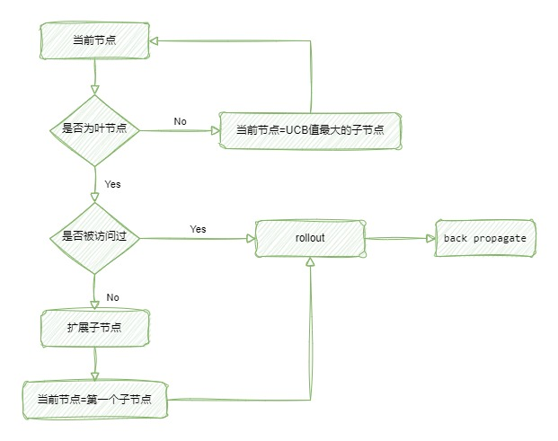

# GomokuMCTS

基于蒙特卡洛树搜索（MCTS）算法的五子棋AI。

一直想做一个五子棋的AI。由于不是计算机专业的，在数据结构与算法方面比较弱，不太知道如何实现alpha-beta剪枝算法。会一点深度学习，尝试过使用DQN去实现五子棋AI，效果并不好。

近来看了一个关于[MCTS算法](https://www.bilibili.com/video/BV1JD4y1Q7mV)的视频，结合一些基于MCTS的五子棋AI的项目，被MCTS的暴力美学所吸引，动手实现了基于MCTS的五子棋AI。（因为不想写游戏逻辑相关的代码了，棋盘代码源自[gomoku_mcts](https://github.com/TsrmKumoko/gomoku_mcts)，算法方面也从该项目中学习了很多）

## 效果

在我的小破笔记本电脑上，模拟10000次需要1min+，且随着对局的进行，所需时间越来越长，相当慢。AI水平似乎还不太行，复杂的局面会出现不去堵”活三“的情况，可能是搜索次数够？

## TODO

* [ ] 完善算法
* [ ] 添加GUI
* [ ] 实现C#版本（Python太慢啦！！！）
* [ ] 实现MCTS+策略价值网络